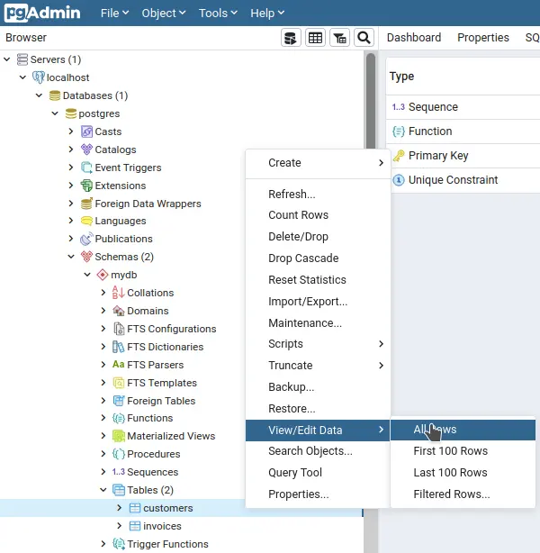
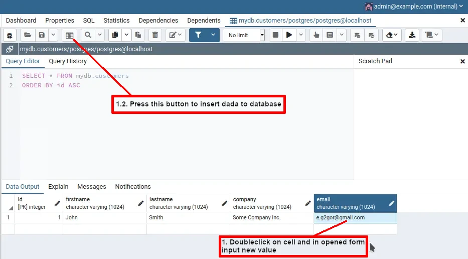

# Invoice Mailer

API-server that render html template of invoice and send it pdf to customer.

To perform valid request, database must contain data of customer with email provided in request body. To add customer data, you may edit file `./docker/postgres/init/2_insert-mock.sql` as described further, or use pgAdmin web interface to insert data manually.

File `./mail.js` with mailing service configuration and authentication data should be placed at `./config/` folder. There is empty template present as example.

----

All pathes below are to be considered relative to folder where this readme file present.
Also, all shell commands by default are supposed to be performed from this folder.

Folder name considered to be `invoice-mailer`, as it be if you pull this repo by default. It's important for Docker Compose usage (it uses folder name as prefix for different things by default)

## Dependencies

[Docker](https://docs.docker.com/get-docker/) + [Docker Compose](https://docs.docker.com/compose/install/)

Click links to read installation guides.

Using linux is strongly advisable.

## Deployment

Remember to put `./mail.js` at `./config/` folder.

----

There is 2 mode of deployment: **development** and **production**.

**Production mode:**

- Not install development dependencies in containers
- Run services: Postgres for database, NodeJS server for API backend

**Development mode:**

- Install development dependencies in containers
- Enable CORS middleware in ExpressJS server for debug purposes
- Run production services
- Run additional services: pgAdmin to manage database, Swagger UI to browse API documentaion and perform test requests

----

Services will be available on **localhost** by URLs:

- API server: <http://localhost:3000>
- pgAdmin: <http://localhost:3001>
- Swagger UI: <http://localhost:3002>

To acces from internet, firewall must be configured for this ports.

----

Delpoyment scripts uses Docker commands. If you added `docker` group to your current user, commands below should work as is. Otherwise sudo is required.

To deploy in production mode, run bash script: `./prod-deploy.sh`

To deploy in development mode, run bash script: `./deploy.sh`

----

To shut down services, run `docker-compose stop`

To remove services, run `docker-compose down`

## Usage of pgAdmin

Web-interface authorisation:

- login: admin@example.com
- password: changeme

Database connection parameters:

- host: postgres
- user: postgres
- database: postgres
- port: 5432
- password: changeme

To edit data in specific table:

1. Select table

2. Insert edited data:

## Usage of Swagger UI

Navigate to <http://localhost:3002> then act by circumstances.

## Manual insert of customer data

In short, you need:

1. Edit mock creation SQL script.
2. Reinitialize postgres database in container, if you need (not required, if no old container present).

In details:

1. Edit file `./docker/postgres/init/2_insert-mock.sql` . There is already one insert query for customer as example.
2. (Optional) Run `docker-compose stop postgres && docker-compose rm -f postgres && docker-compose up -d postgres && docker-compose logs -f postgres` to recreate old postgres container.
